# Performance tools benchmarking

## Abstract

With more load testing tools coming up to the market, performance engineers are in a need to make a better informed decision as to the tool that best suites their needs.
One area of concern, is the tools computational resource consumption such as cpu and memory and how it effects the tools performance and ability to generate high loads efficiently.
When the use of resources is excessive and the load testing tool is not performant, this can lead to unreliable results or high performance testing costs.

In our experiment, we've created a load testing script of equal load model using 3 popular open-source load testing tools 1.JMeter; 2.K6; 3.Locust.
We've ran these scripts on a sterile environment and collected performance metrics from the load generator.

Overall, we saw that JMeter has sever difficulties to generate high load, while locust and K6 performed better, with a slight advantage to K6.

<br>

## Tools Overview


### JMeter

<p>
First introduced in 1998, JMeter is one of the longest standing load testing tools.
It's written in JAVA programming language and implements a thread based architecture, this means that every virtual user is a thread. running in our operating system.

Scripting is done with by using a GUI but can be extended with scripting code, mostly in Groovy language.

JMeter supports distributed execution using a manager-worker architecture, this way we can generate our load from multiple load agents.

JMeter supports various protocols like HTTP, MQTT, JMS, SMTP and many others, and it can be extended with plugins.

JMeter is supported by many Platform as a Service (PaaS) applications, enabling execution of performance tests in cloud environment easily.

Since JMeter uses Threads to generate load, it's usually recommended to optimize JAVA heap memory, so as part of our experiment, we will use JMeter both with the default heap size (1GB) and also with enlarged heap size (4GB)
</P>

<br>

### Locust
Locust is a python based open-source tool.
Unlike JMeter's thread based architecture, Locust is based on python asyncio module, which means that it runs on a single thread while I\O operations are performed concurrently.

Scripting is done in python and locust provide an easy interface to write performance test scripts, making the scripting supper easy and readable.

Locust supports distributed execution using a manager-worker architecture, but unlike JMeter, Locust also allows inter communication between the nodes which improves the ability to synchronize between the nodes and sharing data at run time.


Owing to pythons __Global Interpreter Lock__ (GIL), locust can only use a single CPU core at a time.
To take advantage of multiple cores, it is recommended to instantiate multiple workers on a single machine.

Locust supports various protocols like HTTP, MQTT, JMS, SMTP and many others, and it can be extended with plugins.

To the best of our knowledge there aren't many (or any) PaaS applications supporting locust for in-cloud execution, which means that the platform for cloud execution needs to be implemented (and maintained) by developers.

<br>

### K6

K6 has recently been acquired by Grafana-labs and its being strongly maintained.
Written in Golang, it takes advantage of Golan's powerful concurrency capabilities.

Scripting in K6 however is done with Javascript which is an interesting decision.
K6 creators believe that most programmers are more comfortable writing in Javascript, such that it would allow the tool to have the best of both worlds:
Golangs performance with Javascripts readability.
The intention here is to shift performance testing to the left, to allow software developers to write and execute the tests by themselves.

Unlike JMeter and Locust, K6 does not support distributed execution, for that purpose you'd need to use the commercial version that allows in-cloud distributed execution.

A key advantage of K6 is the ease of integration with visualization tools, namely Grafana, DataDog or CloudWatch, as well as integration with IDE such as visual studio code or intelij.

K6 supports various protocols like HTTP, MQTT, JMS, SMTP and many others, and it can be extended with plugins.

<br>


|   #	                        | JMeter        | K6 	         |Locust|
| :---                          |    :----:     |    :---:       |---:       |
| __Runtime__ 	                | JAVA          | Golang         | Python    |
| __Scripting__ 	            | GUI + Groovy  | Javascript     | Python    |
| __Architecture__ 	            | Thread based  | Go routine     | Asyncio   |
| __Protocols supported__ 	    | Extensive     | Extensive      | Extensive |
| __Plugin extension__ 	        | difficult     | easy           | very easy |
| __distributed mode__ 	        | supported     | licensed       | supported |
>>>>>> table 1 - tools comparison


## Experimental material

### Test Setup

To evaluate performance of the 3 tools, we first set up a testing environment using a m4-large EC2 instance on AWS, it has 2 vCPU cores and 8GB of memory.
We installed all required pre-requisites.
We used AWS cloud-watch to gather performance insights from the EC2 Instance

In total we executed 5 experiments as described in table 2:

<br>


|   #	| mode          	| details |how-to 	                            |
| :---  |    :----:         |---: |   ---:                               |
| 1 	| JMeter-Default  	| Execute load with JMeter, using the default 1GB heap size |[link](./jmeter/README-DEFAULT.md)    |
| 1 	| JMeter-4GB       	| Execute load with JMeter, using the a 4GB heap size |[link](./jmeter/README-4GB.md)  	    |
| 2 	| K6            	| Execute load with K6 |[link](./k6/README.md)  	            |
| 3 	| Locust-single 	| Execute load with Locust in non distributed mode |[link](./locust/README-SINGLE.md)  	|
| 4 	| Locust-dist   	| Execute load with Locust in distributed mode using 2 workers |[link](./locust/README-DIST.md)  	    |

>>>>>> table 2 - experiments.

### Software Under Test

Our Software Under Test (SUT) is a demo 'pet clinic' website developed by ycrash, we are using it's root path as our targeted API.
It runs on EC2 Instance t3a.medium with 2 vCPUs, 4 GB of memory and a standalone load balancer.


### Performance Test Scenario

Our performance test scenario is very simple, we spin up 1000 virtual users in a ramp-up period of 60 seconds, then each of the virtual users sends an http request every 1-5 seconds in a uniform distribution.
Load was kept for 1 hour.

## Measurements:
1. CPU usage - collected from AWSs cloud-watch
2. Memory usage - collected from AWSs cloud-watch
3. Request rate - collected individually from the tools reporter
4. Network bytes sent - collected from AWSs cloud-watch

## Results

<u>### 1. CPU Consumption</u>

#### 1.1 JMeter with default heap size:
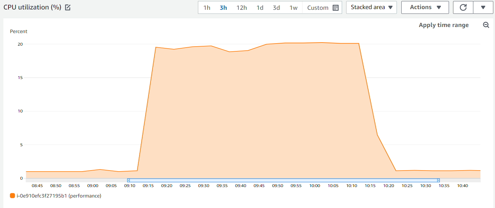
>>>>>> image 1 - JMeter default heap size CPU consumption

#### 1.2 JMeter with 4GB heap size:
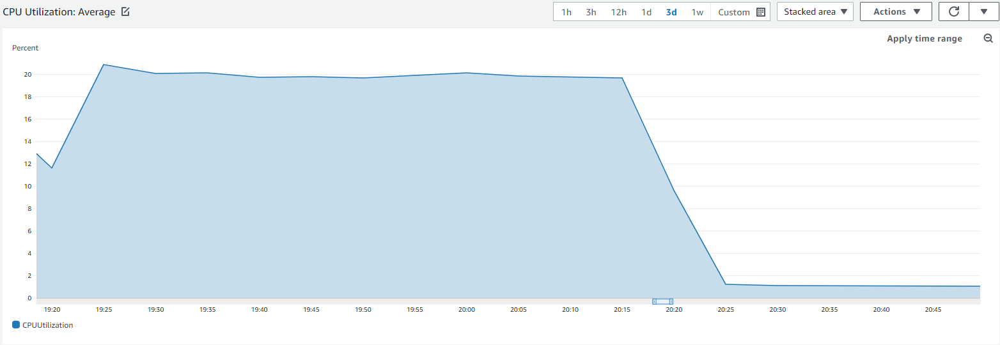
>>>>>> image 2 - JMeter 4GB heap size CPU consumption

#### 1.3 Locust single executor:
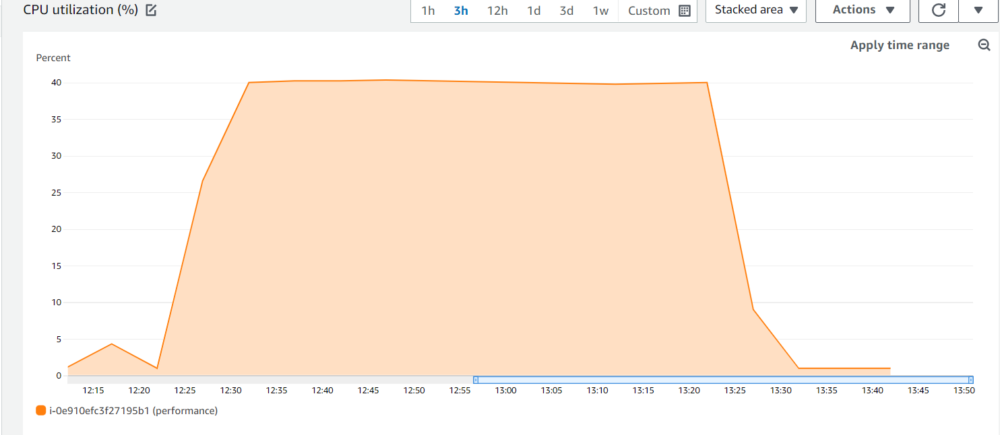
>>>>>> image 3 - Locust single CPU consumption

#### 1.4 Locust with 2 workers:
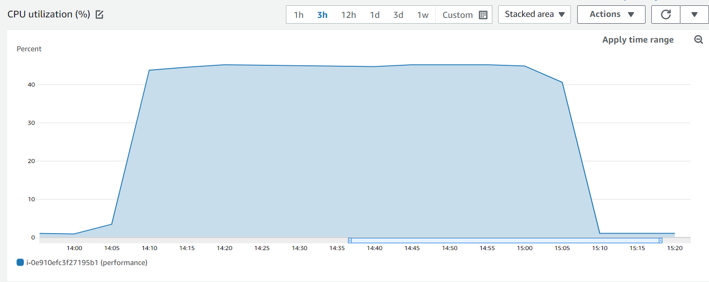
>>>>>> image 4 - Locust distributed CPU consumption

#### 1.5 K6:
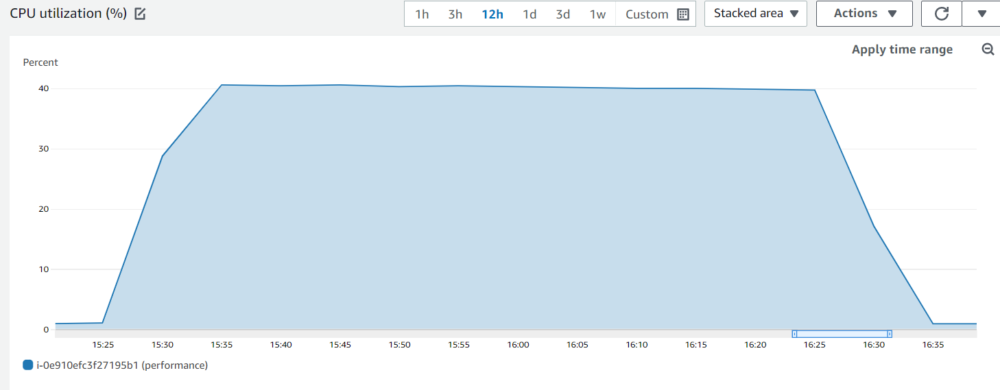
>>>>>> image 5 - K6 CPU consumption

JMeter consumed around 20% of CPU and no difference was observed between the default 1GB heap size and 4GB heap size.

Locust, when executed with a single worker, consumed 40% of CPU, and when bumped up to 2 worker nodes CPU consumption went up to 45%.

K6 consumed slightly more than 40% of CPU.

So at a glimpse, it might seem like JMeter consumes far less CPU than the 2 other tools.

<br>
<u> ### 2. Memory Consumption</u>

#### 2.1 JMeter with default heap size:
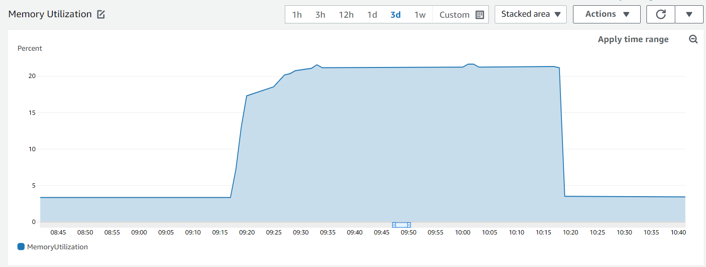
>>>>>> image 6 - JMeter default heap size memory consumption

#### 2.2 JMeter with 4GB heap size:
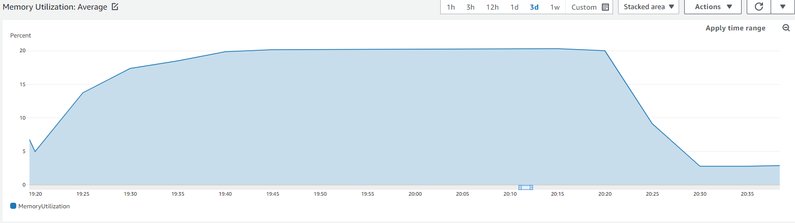
>>>>>> image 7 - JMeter 4GB heap size memory consumption

#### 2.3 Locust single executor:
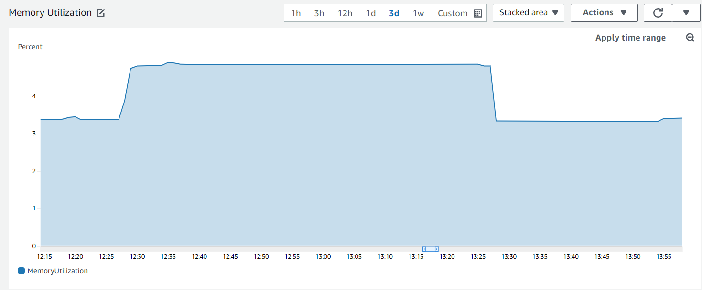
>>>>>> image 8 - Locust single memory consumption

#### 2.4 Locust with 2 workers:
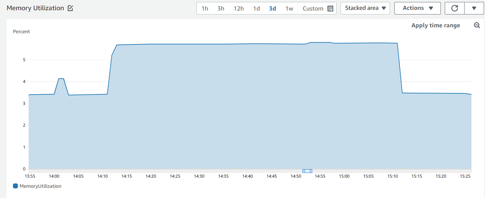
>>>>>> image 9 - Locust single memory consumption

#### 2.5 K6:
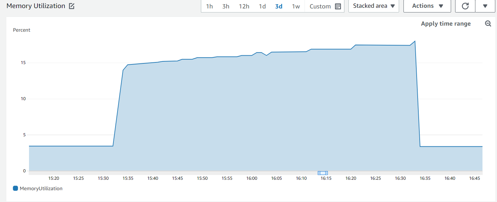
>>>>>> image 10 - K6 memory consumption

JMeter went up to 20% of memory usage, and like with CPU consumption, it doesn't seem to make any difference whether it was configured to 1GB of heap size or 4GB.
Locust single mode consumed 4.8% of memory while Locust with 2 executors consumed 5.7%.
K6 Memory usage progressed gradually from 13% to 18%

It seems like in all instances memory usage was not an issue, with JMeter performing worst, K6 performing slightly better, and Locust being most efficient in memory use.

<br>

<u>### 3. Request rate</u>

#### 3.1 JMeter with default heap size:
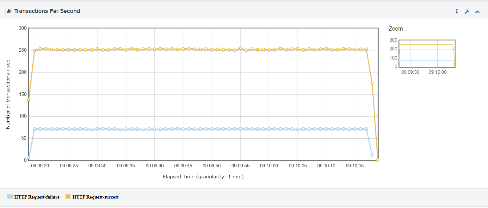
>>>>>> image 11 - JMeter default heap size Request rate

#### 3.2 JMeterwith 4GB heap size:
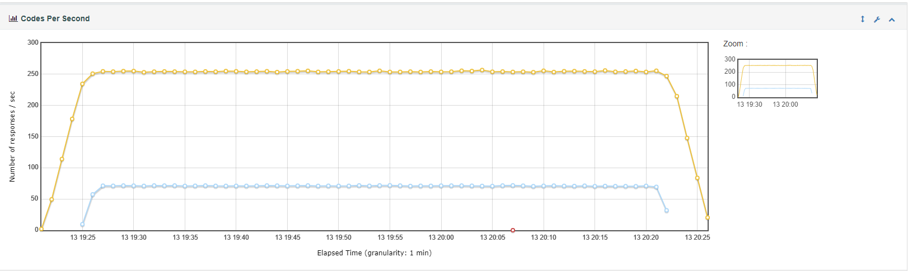
>>>>>> image 12 - JMeter 4GB heap size Request rate

#### 3.2 Locust single executor:
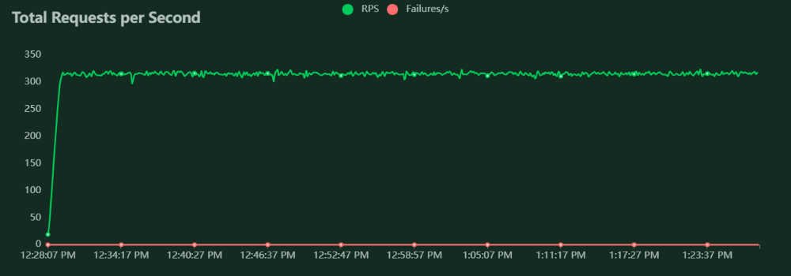
>>>>>> image 13 - Locust single Request rate

#### 3.3 Locust with 2 workers:
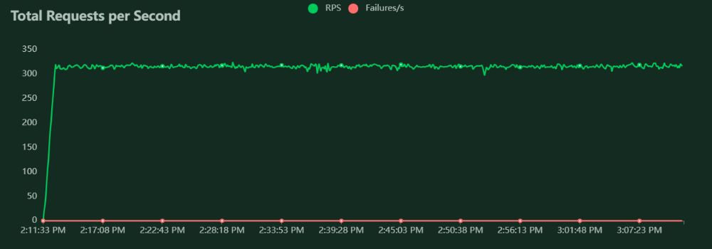
>>>>>> image 14 - Locust distributed Request rate

#### 3.4 K6:
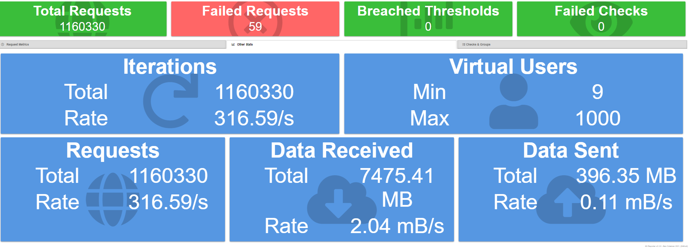
>>>>>> image 15 - K6 Request rate

When looking at request rates we see that all 5 executions performed ~315 requests per second.

However, locust performed with 0 errors, K6 performed with 59 errors in total which is negligible (0.006%), while JMeter performed with a constant rate of about 71 failures per second, around 21% of total requests failed.
Results were similar when executed with 4GB of heap size

So despite the fact that the CPU load was down by a half in JMeter, JMeter was out-performed by Locust and K6 when it comes to success rates.

When looking at the errors in JMeters dashboard we can see the error types:
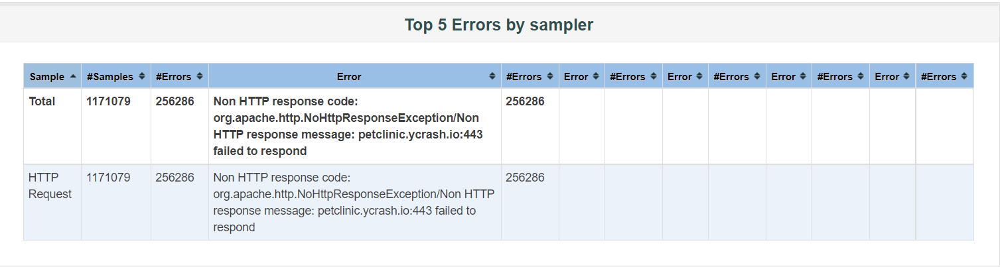
>>>>>> image 16 - JMeter dashboard

```Non HTTP response code: org.apache.http.NoHttpResponseException/Non HTTP response message: petclinic.ycrash.io:443 failed to respond```

This is a low level communication problem.

The interpretation we can give to this, is that the CPU performs many <b>context switching<b> between the threads.
And despite the fact that it is not shown in the CPU consumption, it nonetheless stifles the ability to generate high loads on a single instance.

<br>
<u>### 4. Network - bytes sent</u>

#### 4.1 JMeter with default heap size:
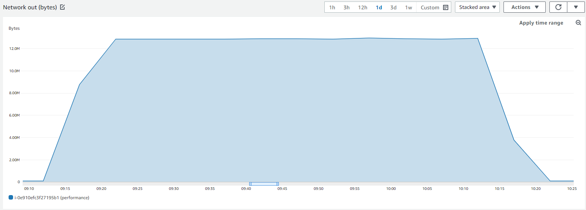
>>>>>> image 17 - JMeter default heap size bytes out

#### 4.2 JMeter with 4GB heap size:
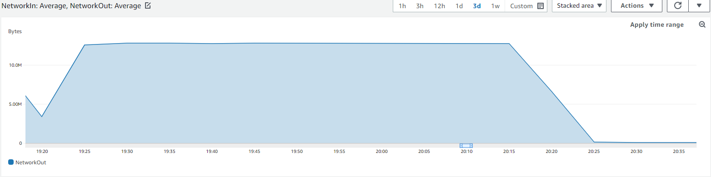
>>>>>> image 19 - JMeter 4GB heap size bytes out

#### 4.3 Locust single executor:
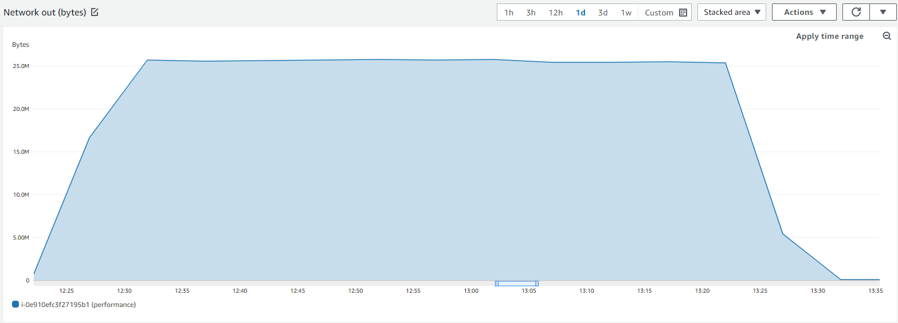
>>>>>> image 20 - Locust single bytes out

#### 4.4 Locust with 2 workers:
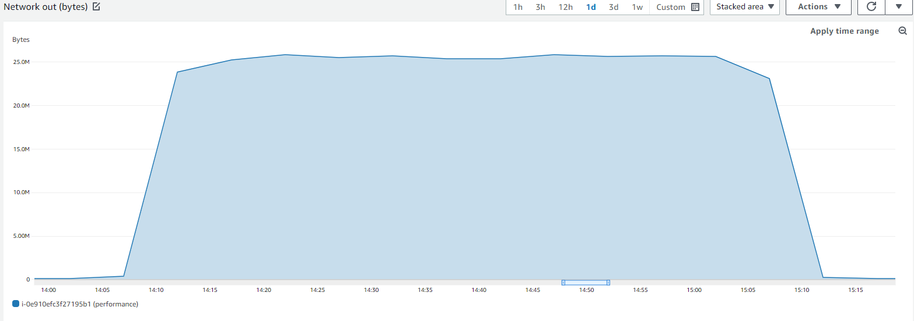
>>>>>> image 21 - Locust distributed bytes out

#### 4.5 K6:
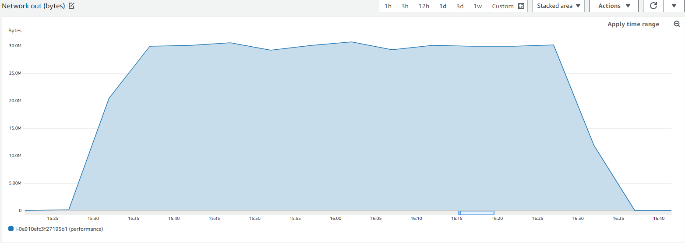
>>>>>> image 22 - K6 bytes out

Locust did not show any difference in network traffic when executed in parallel mode vs single process, in both cases, traffic went up to 25M bytes per minute
Expectation was that adding additional worker will improve performance but it did not seem to be the case in this experiment.
One possible explanation for this could be that any improvement gained by using the 2 cores is lost to costly inter-process communication between the manager and the two workers.

K6 performed slightly better than Locust with 30M bytes per minute.

JMeter however lag far behind with 12M bytes per minute, demonstrating a sever performance bottleneck, this remains the same regardless of heap size being setup to 1GB or 4GB.

## Conclusions
To our best knowledge, this is the first attempt to compare different Load testing tools one against another.
Our experiment shows that JMeter can be costly and require more computational resources than the other tools evaluated.

While JMeter failed to generate load from 1000 virtual users from a single m4 instance, both K6 and Locust had successfully done so with no access resource usage.

Further more, our experiment shows a slight advantage to K6 over Locust when it comes to network traffic, which is expected due to golangs concurrency support.

While our experiment shows that JMeter requires more computational resources, further experiments need to be done to evaluate the extent to which JMeter is more costly and what might be the implications of that on performance assurance efforts.

## Acknowledgement

We would like to thank our friends at **yCrash** for allowing us to use their pet clinic website as a demo application.

yCrash is a state-of-the-art troubleshooting and root cause analysis tool for JAVA application, using cutting edge log file analysis, captures 360-degree artifacts from your technology stack such as Garbage collection logs, thread dumps, heap dumps, netstat, vmstat, kernel logs... analyzes them and instantly identifies the root cause of the problem.

## External links

1. [JMeter](https://jmeter.apache.org/)
2. [Locust](https://locust.io/)
3. [K6](https://k6.io/)
4. [yCrash](https://ycrash.io/)