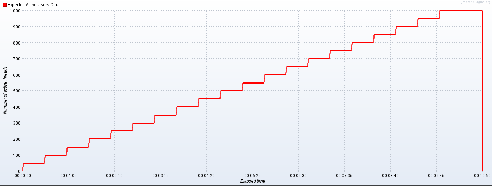

# Performance tools benchmarking

## Abstract

With more load testing tools coming up to the market, performance engineers are in a need to make a better informed decision as to the tool that best suites their needs.
One area of concern, is the tools computational resource consumption such as cpu, memory or I\O.
When the use of resources is excessive and the load testing tool is not performant, this can lead to unreliable results or high performance testing costs.

In our experiment, we've created a  load testing script of equal load model using 3 popular open-source load testing tools 1.JMeter; 2.K6; 3.Locust.
We've ran these scripts on a sterile environment and collected performance metrics from the load generator.

## Tools Overview

### JMeter

First introduced in 1998, JMeter is one of the longest standing load testing tools.
It's written in JAVA programming language and implements a thread based architecture, this means that every virtual user is a thread. running in our operating system.

Scripting is done with by using a GUI but can be extended with scripting code, mostly in Groovy language.

JMeter supports distributed execution using a manager-worker architecture, this way we can generate our load from multiple load agents.

JMeter supports various protocols like HTTP, MQTT, JMS, SMTP and many others, and it can be extended with plugins.

JMeter is supported by many Platform as a Service (PaaS) applications, enabling execution of performance tests in cloud environment easily.

### Locust
Locust is a python based open-source tool.
Unlike JMeter's thread based architecture, Locust is based on python asyncio module, which means that it runs on a single thread while I\O operations are performed concurrently.

Scripting is done in python and locust provide an easy interface to write performance test scripts, making the scripting supper easy and readable.

Locust supports distributed execution using a manager-worker architecture, but unlike JMeter, Locust also allows inter communication between the nodes which improves the ability to synchronize between the nodes and sharing data at run time.

Owing to pythons __Global Interpreter Lock__ (GIL), locust can only use a single CPU core at the time.
To take advantage of multiple cores, it is recommended to instantiate multiple workers on a single machine.

Locust supports various protocols like HTTP, MQTT, JMS, SMTP and many others, and it can be extended with plugins.

To the best of our knowledge there aren't many (or any) PaaS applications supporting locust for in cloud execution, which means that the implementation of cloud execution needs to be implemented by the developers.

### K6

K6 has recently been acquired by Grafana-labs and its being strongly maintained.
Written in Golang, it takes advantage of Golan's powerful concurrency abilities.

Scripting in K6 however is done with Javascript which is an interesting decision.
K6 creators believe that most programmers are more comfortable writing in Javascript, such that it would allow the tool to have the best of both worlds:
Golangs performance with Javascripts readability.

Unlike JMeter and Locust, K6 does not support distributed execution, for that purpose you need to use the commercial version that allows in cloud distributed execution.

A key advantage for K6 is the ease of integration with visualization tools, namely Grafana, DataDog or CloudWatch, as well as integration with IDE such as visual studio code or intelij.

K6 supports various protocols like HTTP, MQTT, JMS, SMTP and many others, and it can be extended with plugins.

|   #	                        | JMeter        | K6 	         |Locust|
| :---                          |    :----:     |    :---:       |---:       |
| __Runtime__ 	                | JAVA          | Golang         | Python    |
| __Scripting__ 	            | GUI + Groovy  | Javascript     | Python    |
| __Architecture__ 	            | Thread based  | Go routine     | Asyncio   |
| __Protocols supported__ 	    | Extensive     | Extensive      | Extensive |
| __Plugin extension__ 	        | difficult     | easy           | very easy |
| __distributed mode__ 	        | supported     | licensed       | supported |
>>>>>> table 1 - tools comparison

## Experimental material

### Setup

To evaluate performance of the 3 tools, we first set up a testing environment using a m4-large EC2 instance on AWS, it has 2 CPU cores and 8GB of memory.
We installed all required pre-requisites.
We used AWS cloud-watch to gather performance insights from the EC2 Instance

Our Software Under Test (SUT) is a demo 'pet-clinic' website developed by ycrash, we are using it's root path as our targeted API.
### Performance test scenario

Our performance test scenario is a "stepping load pattern", starting from 50 virtual users, and then adds 50 more every 30 seconds until it reaches 1000 virtual users, and then holds this load for 60 seconds.

>>>>>>        fig 1 - stepping pattern

Every virtual user sends a get request to SUT every 1 second.

## Measurements:
1. CPU usage.
2. Request rate.
3. Fail rate.
4. Network bytes sent.
5. Network bytes received.

## Results
... TBD
## Conclusions
... TBD
## External links
... TBD